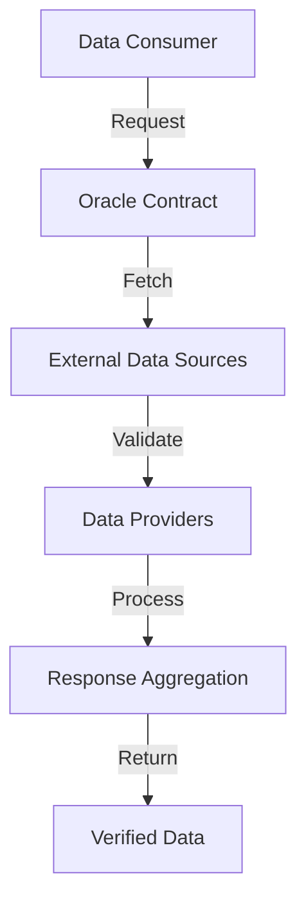

# External Tellor Lexer: Decentralized Data Oracle and Processing System

A robust, blockchain-native oracle and data processing solution built on the Stacks blockchain. External Tellor Lexer provides a secure, transparent mechanism for retrieving, validating, and processing external data sources with high reliability and integrity.

## Overview

External Tellor Lexer introduces a comprehensive smart contract system that:
- Securely fetches and validates external data sources
- Implements multi-stage verification and processing
- Provides decentralized data retrieval mechanisms
- Maintains an immutable record of data requests and responses

### Key Features
- Decentralized oracle infrastructure
- Multi-stage data validation
- Flexible data source integration
- Transparent request and response tracking
- Comprehensive security mechanisms
- Extensible data processing framework

## Architecture

The system is built around a primary smart contract that manages the entire lifecycle of data oracle interactions.



### Core Components
1. **Request Management**: Handle and track data retrieval requests
2. **Validation Layer**: Multi-stage data source verification
3. **Data Processing**: Aggregate and normalize external data
4. **Security Mechanisms**: Prevent manipulation and ensure data integrity
5. **Response Tracking**: Maintain comprehensive request-response logs

## Contract Documentation

### Core Functionality

#### Access Control
- `contract-owner`: System administrator
- `authorized-providers`: Verified data source providers
- `data-processors`: Entities authorized to process and validate data

#### Data Oracle Lifecycle
Each data interaction includes:
- Request metadata and parameters
- Source verification details
- Processing and validation steps
- Response integrity checks
- Historical tracking of interactions

#### Oracle Mechanisms
Supports:
- Flexible data source integration
- Multi-stage validation
- Reputation-based provider selection
- Comprehensive error handling
- Transparent logging

## Getting Started

### Prerequisites
- Clarinet
- Stacks wallet
- Test STX tokens (for testnet)

### Basic Usage

1. **Requesting Data**
```clarity
(contract-call? .tellor-lexer request-external-data
    "price-feed" ; data-type
    { 
        "asset": "BTC/USD",
        "source": ["binance", "coinbase"] 
    } ; request-params
)
```

2. **Submitting Data**
```clarity
(contract-call? .tellor-lexer submit-data-point
    "price-feed" ; data-type
    u42000 ; data-value (price in cents)
    tx-sender ; data-provider
)
```

3. **Validating Data**
```clarity
(contract-call? .tellor-lexer validate-data-point
    u1 ; request-id
    true ; validation-result
)
```

## Function Reference

### Administrative Functions
- `transfer-ownership(new-owner)`
- `register-data-provider(provider)`
- `remove-data-provider(provider)`

### Oracle Functions
- `request-external-data(data-type, params)`
- `submit-data-point(data-type, value, provider)`
- `validate-data-point(request-id, is-valid)`

### Utility Functions
- `get-request-details(request-id)`
- `get-provider-reputation(provider)`
- `get-latest-data-point(data-type)`

## Development

### Testing
Run the test suite using Clarinet:
```bash
clarinet test
```

### Local Development
1. Clone the repository
2. Install dependencies with `clarinet requirements`
3. Start local development chain with `clarinet start`

## Security Considerations

### Key Safeguards
- Multi-level provider authentication
- Reputation-based provider selection
- Cryptographic data validation
- Request-response integrity checks
- Economic incentives for honest participation

### Limitations
- Dependent on external data source availability
- Potential latency in data retrieval
- Requires ongoing provider reputation management